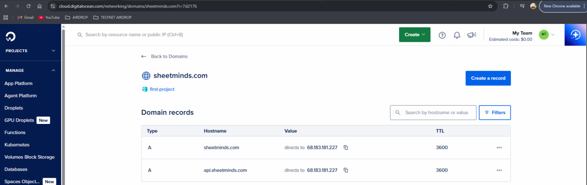
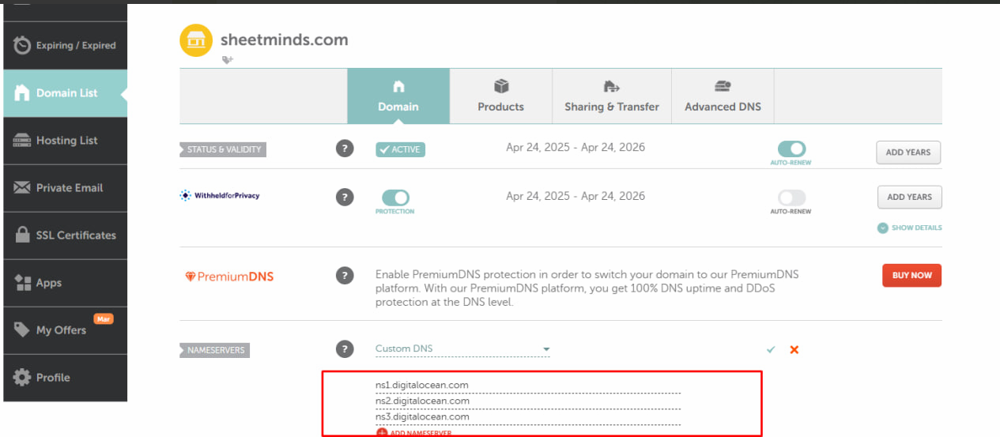

CẤU HÌNH DOMAIN

MAP DOMAIN
1. Cài nginx trên ubuntu sudo apt update 
sudo apt install nginx

2. Mở tệp cấu hình 
sudo nano /etc/nginx/sites-available/default

server {
    listen 80;
    server_name sheetminds.com api.sheetminds.com;

    location / {
        proxy_pass http://localhost:3070;
        proxy_http_version 1.1;
        proxy_set_header Upgrade $http_upgrade;
        proxy_set_header Connection 'upgrade';
        proxy_set_header Host $host;
        proxy_set_header X-Real-IP $remote_addr;
        proxy_set_header X-Forwarded-For $proxy_add_x_forwarded_for;
        proxy_set_header X-Forwarded-Proto $scheme;
    }

    location /socket.io/ {
        proxy_pass http://localhost:3070;
        proxy_http_version 1.1;
        proxy_set_header Upgrade $http_upgrade;
        proxy_set_header Connection "upgrade";
        proxy_set_header Host $host;
        proxy_set_header X-Real-IP $remote_addr;
        proxy_set_header X-Forwarded-For $proxy_add_x_forwarded_for;
        proxy_set_header X-Forwarded-Proto $scheme;
        proxy_buffering off;
        proxy_cache off;
        proxy_read_timeout 86400s;
        proxy_send_timeout 86400s;
    }
}

3. chạy lệnh để kiểm tra nginx
sudo nginx -t

4. restart lại nginx 
sudo systemctl restart nginx